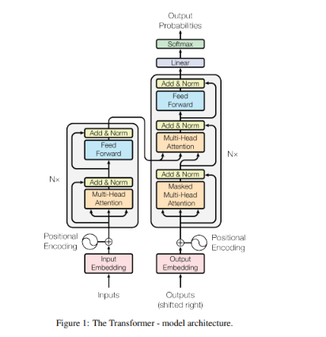

<div align="center">

# ⚡ Transformer From Scratch

## Deployed Transformer =>
[](https://nptransformerlab.netlify.app/)

<hr>
### A complete encoder-decoder Transformer, implemented in raw NumPy — zero deep learning frameworks.

[](https://numpy.org/)
[](https://www.python.org/)
[](#)
[](#)
[](#)

*Every matrix multiply, every gradient, every backward pass — derived and coded by hand.*

</div>

---

## 📖 Overview

This repository implements the **"Attention Is All You Need"** ([Vaswani et al., 2017](https://arxiv.org/abs/1706.03762)) architecture from first principles — no `torch.nn`, no `tf.keras`, no autograd. Forward propagation *and* backpropagation for every layer — embeddings, multi-head attention, layer normalization, feed-forward blocks — are hand-derived using the chain rule and implemented directly in NumPy.

> **Why?** Using `nn.MultiheadAttention` teaches you how to call a Transformer. Deriving `∂L/∂Q`, `∂L/∂K`, `∂L/∂V` by hand and watching your gradient check converge to `1e-9` teaches you how one actually *works*.

<div align="center">

```
 raw text  →  tokens  →  embeddings  →  ┌─────────────┐        ┌─────────────┐
                                          │   ENCODER    │  ───►  │   DECODER    │  ───►  logits ──► softmax ──► response
                                          │   (N × )    │        │   (N × )    │
                                          └─────────────┘        └─────────────┘
                                          self-attention        masked self-attn
                                          feed-forward           cross-attention
                                                                  feed-forward
```

</div>

---

## 🏗️ Architecture

<div align="center">
  
  <p><em>Figure 1: The Transformer model architecture (Vaswani et al., 2017)</em></p>
</div>

<table>
<tr>
<td width="50%" valign="top">

### Encoder Stack
```
Input Embedding
      +
Positional Encoding
      │
      ▼
┌──────────────────┐
│  Multi-Head       │
│  Self-Attention    │──┐
└──────────────────┘  │ residual
      │  Add & Norm ◄──┘
      ▼
┌──────────────────┐
│  Feed Forward      │──┐
└──────────────────┘  │ residual
      │  Add & Norm ◄──┘
      ▼
   × N layers
```

</td>
<td width="50%" valign="top">

### Decoder Stack
```
Output Embedding
      +
Positional Encoding
      │
      ▼
┌──────────────────┐
│  Masked Multi-Head │
│  Self-Attention    │──┐
└──────────────────┘  │ residual
      │  Add & Norm ◄──┘
      ▼
┌──────────────────┐
│  Cross-Attention   │◄── Encoder Output
│  (Q=dec, K/V=enc)  │──┐
└──────────────────┘  │ residual
      │  Add & Norm ◄──┘
      ▼
┌──────────────────┐
│  Feed Forward      │──┐
└──────────────────┘  │ residual
      │  Add & Norm ◄──┘
      ▼
   × N layers → Linear → Softmax
```

</td>
</tr>
</table>

### Core equations implemented from scratch

**Scaled dot-product attention**

$$\text{Attention}(Q,K,V) = \text{softmax}\left(\frac{QK^\top}{\sqrt{d_k}}\right)V$$

**Layer normalization**

$$\hat{x}_i = \frac{x_i - \mu}{\sqrt{\sigma^2 + \epsilon}}, \qquad y_i = \gamma \hat{x}_i + \beta$$

**Positional encoding**

$$PE_{(pos, 2i)} = \sin\left(\frac{pos}{10000^{2i/d_{model}}}\right), \quad PE_{(pos, 2i+1)} = \cos\left(\frac{pos}{10000^{2i/d_{model}}}\right)$$

**Cross-entropy loss**

$$\mathcal{L} = -\frac{1}{N}\sum_{i=1}^{N} \log P(y_i \mid x)$$

---

## ✅ What's implemented — forward *and* backward

| Component | Forward | Backward | Gradient-Checked |
|---|:---:|:---:|:---:|
| Tokenizer / Vocabulary | ✅ | — | — |
| Token Embedding | ✅ | ✅ | ✅ |
| Sinusoidal Positional Encoding | ✅ | — (fixed, non-trainable) | — |
| Linear Layer | ✅ | ✅ | ✅ |
| Layer Normalization | ✅ | ✅ | ✅ |
| Multi-Head Attention | ✅ | ✅ | ✅ |
| Causal + Padding Masking | ✅ | ✅ | — |
| Feed-Forward Block | ✅ | ✅ | ✅ |
| Encoder / Decoder Stacks | ✅ | ✅ | — |
| Cross-Attention | ✅ | ✅ | — |
| Output Projection + Softmax | ✅ | ✅ | — |
| Cross-Entropy Loss | ✅ | ✅ | — |
| SGD Optimizer | ✅ | — | — |

Every ✅ under **Gradient-Checked** was verified against numerical (finite-difference) gradients before being trusted — analytical vs. numerical differences consistently landed under `1e-6`.

---

## 🚀 Demo

```
You : hi how are you?
Output: i'm sorry .

You : what's your name?
Output: it's not asking for early of elastic .

You : how are you feeling?
Output: i just give me a good time .
```

> Trained on a small, hand-built conversational dataset with no GPU acceleration. Outputs are topically coherent but not always fully grammatical — a direct, expected consequence of dataset and model scale, not an implementation defect. See [Limitations](#-limitations).

---

## 📂 Project structure

```
transformer-from-scratch-numpy/
├── TextPreprocessing.py     # tokenizer + vocabulary construction
├── EncodeDecode.py          # encoding, batching, padding, masks
├── EmbaddingLayer.py        # token embedding lookup table
├── positionalEncoding.py    # sinusoidal positional encoding
├── LinearLayer.py           # dense layer   (∂L/∂W, ∂L/∂b, ∂L/∂x)
├── LayerNorm.py             # layer norm    (3-term gradient derivation)
├── MultiHeadAttention.py    # Q/K/V projections, softmax, masking
├── FeedForward.py           # position-wise 2-layer MLP + ReLU
├── EncoderBlock.py / Encoder.py
├── DecoderBlock.py / Decoder.py
├── OutputProjection.py      # final linear → vocab logits
├── LogLoss.py                # cross-entropy loss + backward
├── SGD.py                    # optimizer step
├── Transformer.py            # top-level model — forward() / backward()
├── SaL.py                    # checkpoint save / load (.npz + config.json)
├── train.py                  # training loop, live progress bar
└── test.py                   # autoregressive inference
```

---

## ⚙️ Usage

### 1. Prepare data

`json_data/pairs.json`:
```json
[
  {"encoder": "how are you", "decoder": "i am fine how about you"},
  {"encoder": "what is your name", "decoder": "my name is bot"}
]
```

### 2. Train

```bash
python train.py
```

```
Loaded 28 raw pairs from json_data/pairs.json
Built vocab: 87 tokens
Total trainable parameters: 87
Epoch   1/300 | avg loss: 4.3529 -
Epoch   2/300 | avg loss: 4.3410 ↓
   ...
Epoch 300/300 | avg loss: 3.1913 ↓
Model saved to checkpoints/final/
```

### 3. Run inference

```bash
python test.py
```

### Hyperparameters (`train.py`)

| Parameter | Value | |
|---|:---:|---|
| `embedding_dim` | 32 | model width (`d_model`) |
| `num_heads` | 4 | attention heads |
| `hidden_dim` | 128 | feed-forward inner dimension |
| `num_layers` | 2 | encoder / decoder depth |
| `learning_rate` | 0.01–0.05 | SGD step size |
| `batch_size` | 4–16 | scaled to dataset size |

---

## 🧠 Motivation

Frameworks like PyTorch abstract away the exact mechanics of a Transformer behind `nn.MultiheadAttention` and `.backward()`. This project exists to remove that abstraction entirely:

- **Why** does attention use `QKᵀ/√d_k` and not just `QKᵀ`?
- **Why** does LayerNorm's backward pass need three separate correction terms, not one?
- **Why** does teacher-forcing shift the decoder target by exactly one position?

Every one of those questions was worked through by hand — algebraically, then numerically — before being written as code.

---

## ⚠️ Limitations

- 🔸 Small training corpus (tens–hundreds of pairs) → limited grammatical generalization
- 🔸 Pure NumPy, single-threaded, no GPU — not built for scale, built for understanding
- 🔸 Greedy decoding only — no beam search / nucleus sampling (yet)
- 🔸 Word-level tokenization — no subword/BPE handling of unseen words

## 🗺️ Possible next steps
- [ ] Larger conversational dataset
- [ ] Byte-pair encoding tokenizer

---

<div align="center">

*Built layer by layer, gradient by gradient.*

</div>
